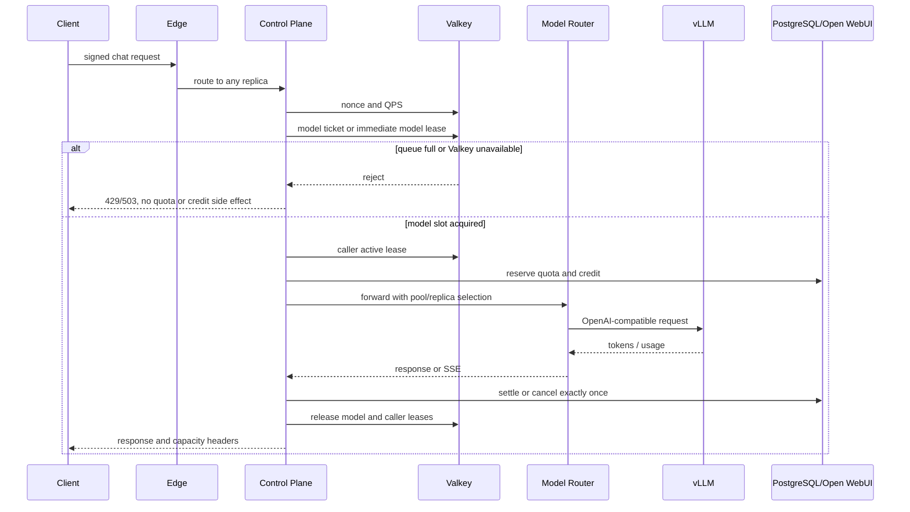

# 200 用户并发容量架构

状态：设计冻结候选，等待服务器硬件、模型和 Token 分布确认后进入实现。

本文回答的是“服务器上允许 200 个人同时使用”如何落地，不把一个 `concurrency_limit=200` 配置误当成 200 路模型推理能力。容量必须拆成三层：连接、排队请求和 GPU 正在处理的生成序列。

## 1. 结论

第一阶段采用小而明确的部署拓扑：

```text
Internet / Open WebUI / SDK
              |
       Caddy 或 Envoy edge
              |
      4 个无状态 Control Plane
              |
   共享 Valkey + PostgreSQL
              |
        单 Bifrost OSS
              |
   vLLM 模型池（1 个或多个副本）
```

- Zangpu Control Plane 负责签名认证、配额、全局/调用方/模型池准入和队列，不把这些权威交给 Bifrost。
- Valkey 是跨 Control Plane 副本的实时准入权威；PostgreSQL 是配置、操作和审计的持久权威。
- Bifrost OSS 先保留为单实例兼容网关。它的 OSS 多节点方案只共享 `config.json`，不提供 PostgreSQL-backed 的运行时状态同步；严格的集群同步属于 Enterprise。
- vLLM 负责连续批处理、KV cache 和模型执行。模型池的实际并行数必须通过目标模型和 GPU 的压测得到。
- 出现多个 GPU 节点后，再引入 Envoy Gateway + Gateway API Inference Extension + llm-d Router；KServe 作为 Kubernetes 运维和自动伸缩层的可选组合。

这意味着“200 人在线”可以先作为第一阶段设计目标；是否达到必须经过 C200 真实连接验收。“200 个请求同时生成”还必须以硬件实测为准，不能在没有模型和 GPU 参数时承诺。

## 2. 三层容量定义

| 层 | 名称 | 建议初始值 | 权威 | 超限行为 |
| --- | --- | ---: | --- | --- |
| 连接 | `connection_limit` | 260（200 + 30% 余量） | edge/进程资源 | 拒绝新连接或返回 503 |
| 排队 | `queue_limit` | 200 个请求 | Valkey ticket | 429 + `Retry-After`，不调用模型、不扣费 |
| 推理 | `model_active_limit` | 按模型池实测 | Valkey model lease | 等待可用槽位，超过队列上限则 429 |

`connection_limit` 只保护 HTTP/SSE、文件描述符和内存；它不应该直接写进模型并发配置。`queue_limit` 允许 200 个用户同时发起请求，但必须有等待上限和取消机制。`model_active_limit` 是真正保护 GPU 的硬闸门。

每个调用方继续保留当前的 `concurrency_limit`，另外增加独立的 `queue_limit`。推荐初始策略是：

```text
caller_active_limit = 当前策略中的 concurrency_limit
caller_queue_limit  = min(8, max(1, 2 * caller_active_limit))
global_queue_limit  = 200
```

调用方队列额度防止单个 Secret 占满全局队列；管理员可以按租户等级调整，而不改变 GPU 池的硬容量。

## 3. 请求生命周期



准入顺序固定为：认证和 nonce -> 调用方策略 -> QPS -> 请求大小校验 -> 模型池排队/租约 -> 调用方 active lease -> SQL quota reserve -> Open WebUI credit reserve -> Bifrost/vLLM。排队期间不占用调用方 active lease，不写 prompt 到 Valkey，不预扣费，也不创建 SQL operation。模型租约或调用方租约其中一侧已取得而另一侧失败时，必须立刻 exact-owner release 已取得的一侧。

### 队列规则

- 队列 ticket 只包含哈希化调用方标识、模型池、operation ID、创建时间、过期时间和优先级，不包含 prompt、Secret 或响应内容。
- 默认 FIFO；同一优先级按调用方轮转，避免一个调用方连续占据所有槽位。
- `queue_wait_timeout` 建议从 30 秒开始，超时返回 429；客户端断开、取消或请求超时必须删除 ticket。
- SSE 在取得模型槽位前不发送成功响应。取得槽位后沿用现有 heartbeat 和 lease guard；等待中的 HTTP 协程受全局队列上限保护。
- Valkey 错误必须 fail closed 为 503，不能降级为本地计数。租约丢失时取消上游请求并执行已有的补偿流程。

## 4. 模型池容量

### 4.1 静态硬容量

每个模型池登记一组副本，每个副本至少有以下状态：

```text
pool_id, model_id, replica_id, endpoint
admission_capacity, active_leases, health, heartbeat_expires_at
vllm_version, max_num_seqs, max_model_len, max_num_batched_tokens
```

第一版的 `admission_capacity` 必须是管理员确认的静态值，不能直接把 vLLM 的 `max-num-seqs` 当作可承诺容量。推荐：

```text
replica_admission_capacity
  = floor(stable_benchmark_sequences * 0.80)
model_active_limit
  = sum(healthy replica_admission_capacity)
```

20% 是初始安全余量，不是合同 SLA。只有副本心跳新鲜、模型版本和配置匹配、健康检查通过时，容量才进入总和；过期副本立即从可用容量中移除。

### 4.2 vLLM 运行约束

vLLM 的 `max_num_seqs`、`max_num_batched_tokens`、`max_model_len`、`gpu_memory_utilization`、`kv_cache_memory_bytes` 和 `cache_dtype` 会共同决定可承载的序列数。必须固定并记录这些参数，配合 `/metrics` 的运行、等待、KV cache 和延迟指标做版本化监控。

外部模型租约解决“不要把请求送入已满的池”；vLLM 内部连续批处理解决“已准入请求如何共享 GPU”。两者都保留，不能只依赖 vLLM 自带等待队列，因为那样 Zangpu 无法给用户提供全局队列上限、调用方公平性和准确的 `Retry-After`。

### 4.3 容量计算

硬件输入齐全后，用以下公式计算副本数，而不是拍脑袋按用户数复制：

```text
kv_bytes_per_token
  = 2 * num_layers * num_kv_heads * head_dim * bytes_per_kv_value

usable_kv_bytes
  = gpu_memory_bytes * gpu_memory_utilization
    - model_weights_bytes - activation_reserve_bytes

memory_bound_sequences
  = floor(usable_kv_bytes / (kv_bytes_per_token * max_context_tokens))

throughput_bound_replicas
  = ceil(
      active_users * target_decode_tokens_per_second_per_user
      / measured_decode_tokens_per_second_per_replica
    )
```

最终容量取内存、吞吐、`max_num_seqs`、上下文长度和错误率约束中的最小值。若合同要求 200 个请求同时处于生成阶段，应至少满足：

```text
sum(stable_benchmark_sequences across healthy replicas) >= 250
```

这里的 250 是在 20% 安全余量下的起始工程目标，不是对任何具体 GPU/模型的容量承诺。若合同只要求 200 人在线、同时生成峰值为 20，则模型池目标应按 20 设计，剩余请求进入有界队列。

## 5. 部署剖面

### Profile A：单服务器、先交付

适合当前合同阶段和一台服务器：

- Caddy 1 个实例，SSE 不缓冲，长连接超时按最长生成时间配置。
- Control Plane 4 个容器副本，每个容器 1 个 Uvicorn worker；使用容器副本扩展，不在一个容器里复制数据库、Valkey 和 HTTP 客户端池。
- PostgreSQL 1 个实例，所有 SQL 操作保持短事务；当连接数或故障恢复要求提高时增加 PgBouncer 或托管 PostgreSQL。
- Valkey 1 个持久化实例，AOF、密码、只在私网暴露；生产高可用时换 Valkey Sentinel/托管 Valkey，不改变 Lua 准入协议。
- Bifrost OSS 1 个固定实例，版本和镜像 digest 锁定。Control Plane 的 outbox 只对这一个管理端点做绑定同步。
- vLLM 按 GPU 数量部署 1 个或多个模型副本；每个副本通过 OpenAI-compatible API 提供给模型路由。

这一剖面以 200 个在线 HTTP/SSE 连接为验收目标，但是否达到必须由 `20 -> 50 -> 100 -> 200` 真实压测决定；是否支持 200 个活跃生成更必须由 GPU 基准决定。它不宣称跨物理主机的高可用。

### Profile B：多 GPU / 多服务器

当 Profile A 的模型池达到瓶颈时迁移到 Kubernetes：

```text
Gateway API / Envoy Gateway
              |
       llm-d Router + EPP
              |
       InferencePool
      /      |       \
   vLLM-1  vLLM-2   vLLM-N
```

- Control Plane 使用 Deployment，至少 4 个副本；HPA 依据 CPU、请求速率和队列长度扩缩，不依据 GPU 利用率单一指标。
- Gateway API Inference Extension 提供 `InferencePool` API；生产 EPP/请求调度使用 `llm-d/llm-d-router`，由 KV cache、当前负载和优先级进行选点。
- KServe 只在需要 Kubernetes 模型生命周期、请求型自动伸缩、模型缓存或 KV offload 时加入；它不是单服务器的必要依赖。
- Bifrost 若也需要多副本强一致，使用其 Enterprise clustering；不把 OSS 的共享配置文件伪装成实时状态复制。若保留 OSS 单实例，则把 Bifrost 放在 Control Plane 与模型路由之前，并接受它是网关级单点。

## 6. 开源组件选择

| 组件 | 许可证 | 在本项目中的职责 | 结论 |
| --- | --- | --- | --- |
| [Bifrost](https://github.com/maximhq/bifrost) | Apache-2.0；clustering/adaptive LB 为 Enterprise | 统一 provider、虚拟 key、回退和兼容接口 | OSS 单实例先用；不依赖 OSS 集群状态 |
| [vLLM](https://github.com/vllm-project/vllm) | Apache-2.0 | GPU 推理、连续批处理、KV cache、OpenAI API | 首选模型运行时 |
| [Valkey](https://github.com/valkey-io/valkey) | BSD-3-Clause | 全局租约、队列 ticket、容量心跳 | 保留为准入权威 |
| [Envoy Gateway](https://github.com/envoyproxy/gateway) | Apache-2.0 | Kubernetes edge/L7 gateway | 多副本阶段候选 |
| [Gateway API Inference Extension](https://github.com/kubernetes-sigs/gateway-api-inference-extension) | Apache-2.0 | `InferencePool` 与 Gateway API 合约 | 多模型池阶段候选 |
| [llm-d Router](https://github.com/llm-d/llm-d-router) | Apache-2.0 | KV-cache/负载/优先级感知的 EPP 路由 | 多 GPU 阶段优先 |
| [KServe](https://github.com/kserve/kserve) | Apache-2.0 | Kubernetes 模型生命周期和自动伸缩 | 按运维复杂度选择 |
| [SGLang](https://github.com/sgl-project/sglang) | Apache-2.0 | vLLM 的模型运行时备选 | 只在基准测试证明收益时替换 |

没有选用 `ai-dynamo/dynamo` 作为第一方案：GitHub 仓库元数据的许可证字段为 `NOASSERTION`，且它面向数据中心级分布式推理，当前服务器规模下引入成本和审查范围都过大；如后续评估，必须单独完成许可证文件和依赖许可证审查。

## 7. 当前代码差距

当前仓库已经有：

- Valkey exact-owner concurrency lease、heartbeat、release 和 fail-closed 错误处理。
- 调用方级 `concurrency_limit`、容量响应头、饱和时的 `429`/`Retry-After`。
- 非流式和 SSE 流式的 lease guard、断开补偿和 Open WebUI exact-once credit 生命周期。
- 单进程 Compose 拓扑、Bifrost preflight、PostgreSQL/Valkey 私网边界和 k6 并发控制脚本。

进入 200 用户实现前仍缺少：

1. 全局队列 ticket、取消、超时、轮转公平和排队可观测性。
2. 模型池/副本注册、容量心跳、过期剔除和 per-model active lease。
3. 请求选择的模型池路由；当前 Bifrost 客户端只知道一个管理/推理端点。
4. 4 副本 Control Plane 的 Compose/Kubernetes 部署、资源限制、优雅停机和代理长连接参数。
5. vLLM `/metrics` 版本锁定、容量注册器和 Prometheus/Grafana 指标面板。
6. PostgreSQL/Valkey/Bifrost/Open WebUI/vLLM 真实联调，以及 20/50/100/200 分阶段压测。

## 8. 验收分阶段

| 阶段 | 目标 | 必须证明 |
| --- | --- | --- |
| C20 | 20 个长连接或 20 个请求 | SSE 心跳、断开清理、无连接泄漏 |
| C50 | 50 个连接/请求 | Control Plane 副本均衡、Valkey 无超发 |
| C100 | 100 个连接/请求 | 队列上限、调用方公平、模型池不超容量 |
| C200 | 200 个在线连接 | 连接成功率、SSE 稳定性、代理无缓冲/超时 |
| G200 | 200 个同时生成（若合同要求） | 真实 GPU Token 吞吐、TTFT、KV cache、显存、错误率和精确 active lease |

每一阶段都要记录：成功/429/503 数、队列等待时间、TTFT、端到端延迟、输入/输出 Token、GPU 显存、KV cache 使用率、vLLM running/waiting、Valkey active lease 峰值和 PostgreSQL 连接峰值。k6 只做请求驱动和协议验收；GPU 容量必须在真实模型服务器上完成。

## 9. 进入实现所需输入

在添加模型池和队列代码前，需要冻结以下输入：

- GPU 型号、显存、数量、是否跨服务器和 GPU 互联方式。
- 目标模型、量化格式、模型权重大小、最大上下文长度。
- 平均/峰值输入 Token、最大输出 Token、期望每用户生成速度。
- “200 人同时使用”是 200 个在线连接、200 个同时提交请求，还是必须 200 个请求同时 decode。
- 允许的最大排队时间、TTFT/端到端延迟、429/503 率和是否允许降级模型。

这些输入确定 `model_active_limit` 和副本数；在输入确认前，只能冻结架构和接口，不能诚实地冻结 GPU 数量或 200 路活跃推理承诺。

## 10. 参考资料

- [Bifrost OSS multinode boundary](https://github.com/maximhq/bifrost/blob/dev/docs/deployment-guides/how-to/multinode.mdx)
- [Bifrost cluster is Enterprise](https://github.com/maximhq/bifrost/blob/dev/docs/deployment-guides/config-json/cluster.mdx)
- [vLLM engine arguments](https://github.com/vllm-project/vllm/blob/main/docs/configuration/engine_args.md)
- [vLLM production metrics](https://github.com/vllm-project/vllm/blob/main/docs/usage/metrics.md)
- [Gateway API Inference Extension](https://github.com/kubernetes-sigs/gateway-api-inference-extension)
- [llm-d Router](https://github.com/llm-d/llm-d-router)
- [KServe generative inference](https://github.com/kserve/kserve)
